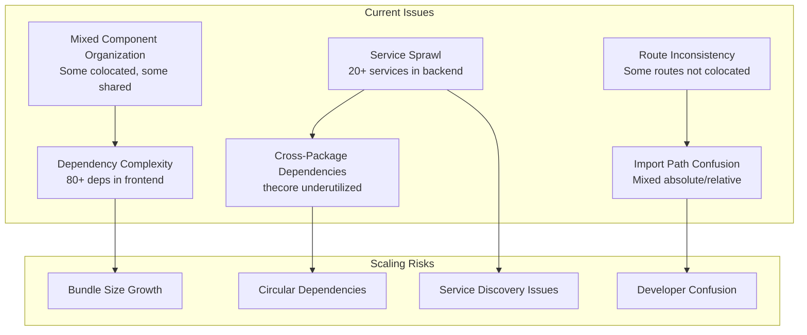

# 🏗️ HQ Project Architecture Analysis & Scaling Strategy

> **Generated**: January 2025  
> **Status**: Active Development  
> **Team Size**: Solo → Multi-developer transition

## 📊 Executive Summary

This document provides a comprehensive analysis of the HQ monorepo architecture and outlines a strategic plan for scaling from solo development to a multi-developer team. The project shows excellent foundational patterns but requires systematic improvements to handle future growth and team collaboration.

## 🎯 Current State Assessment

### ✅ Strengths

- **Modern Tech Stack**: Next.js 14, Hono, Drizzle ORM, TypeScript
- **Monorepo Structure**: Clear separation with Turbo build system
- **Colocation Progress**: Analytics & Figma Analyzer routes successfully refactored
- **Service Architecture**: Well-organized backend services
- **Comprehensive Tooling**: Storybook, Changesets, ESLint, Prettier

### 🚨 Scaling Challenges



## 📦 Package Structure Analysis

### Current Monorepo Layout

```
packages/
├── thehorizon/          # Frontend (Next.js)
│   ├── 80+ dependencies
│   ├── Mixed component organization
│   └── Partial route colocation
├── thegrid/             # Backend (Hono)
│   ├── 60+ dependencies
│   ├── 20+ services
│   └── Well-structured routes
├── thecore/             # Shared utilities
│   ├── Underutilized
│   └── Limited shared types
└── anton-grid/          # Specialized functionality
    └── Domain-specific features
```

### Dependency Analysis

#### Frontend (thehorizon) - 80+ Dependencies

- **UI Framework**: 15+ Radix components
- **Rich Text**: 5+ TipTap packages
- **Dev Tools**: 15+ Storybook packages
- **Utilities**: 10+ misc packages
- **Risk**: Bundle size growth, maintenance overhead

#### Backend (thegrid) - 60+ Dependencies

- **AI/ML**: OpenAI, Google GenAI, Langfuse
- **Database**: Drizzle, PostgreSQL
- **Services**: AWS, Qdrant, Storyblok
- **Risk**: Service coupling, deployment complexity

## 🎯 Strategic Improvement Plan

### Phase 1: Complete Route Colocation (1-2 weeks)

#### Immediate Actions Required

**Routes Needing Colocation:**

- [ ] **Chat Route**: `src/components/Chat/*` → `src/app/chat/_components/`
- [ ] **Pipelines Route**: `src/components/pipelines/*` → `src/app/pipelines/_components/`
- [ ] **Approvals Route**: Audit and colocate if needed
- [ ] **Settings Route**: Audit and colocate if needed

**Implementation Steps:**

```bash
# 1. Create colocation directories
mkdir -p src/app/chat/_components src/app/chat/_hooks
mkdir -p src/app/pipelines/_components src/app/pipelines/_hooks

# 2. Move route-specific components
mv src/components/Chat/* src/app/chat/_components/
mv src/components/pipelines/* src/app/pipelines/_components/

# 3. Update import paths
# Convert absolute imports to relative for colocated code
# Update page.tsx files to use ./_components/

# 4. Verify no shared usage
grep -r "ChatArea\|pipelines-page" src/app/*/
```

**Success Criteria:**

- All route-specific components colocated
- Import paths follow established conventions
- No broken dependencies
- Bundle optimization achieved

### Phase 2: Dependency Architecture Optimization (2-3 weeks)

#### Frontend Dependency Cleanup

**Bundle Analysis Strategy:**

```bash
# Analyze current bundle
npm run build -- --analyze

# Check for unused dependencies
npx depcheck packages/thehorizon

# Identify duplicate dependencies
npm ls --depth=0
```

**Optimization Targets:**

1. **UI Consolidation**: Create wrapper components for Radix
2. **Dev Dependency Audit**: Move non-production deps appropriately
3. **Tree Shaking**: Ensure proper import patterns
4. **Bundle Splitting**: Optimize route-based code splitting

#### Backend Service Architecture

**Current Service Organization:**

```
services/
├── Individual files (10+)
├── Service directories (10+)
└── Mixed patterns
```

**Proposed Domain-Based Architecture:**

```
services/
├── domains/
│   ├── user/           # User management services
│   ├── content/        # Content and media services
│   ├── integration/    # External API services
│   └── ai/            # AI and ML services
├── shared/
│   ├── database/      # Database utilities
│   ├── auth/          # Authentication
│   └── validation/    # Schema validation
└── registry/
    └── service-registry.ts  # Service discovery
```

### Phase 3: Package Architecture Refinement (3-4 weeks)

#### thecore Package Enhancement

**Current State:**

- Minimal shared types
- Underutilized potential
- Limited cross-package benefits

**Proposed Structure:**

```typescript
packages/thecore/
├── src/
│   ├── types/           # Shared TypeScript types
│   │   ├── api.types.ts
│   │   ├── user.types.ts
│   │   └── common.types.ts
│   ├── schemas/         # Shared Zod schemas
│   │   ├── validation/
│   │   └── api/
│   ├── utils/           # Pure utility functions
│   │   ├── date.utils.ts
│   │   ├── string.utils.ts
│   │   └── validation.utils.ts
│   ├── constants/       # Shared constants
│   │   ├── api.constants.ts
│   │   └── app.constants.ts
│   └── interfaces/      # Service contracts
│       ├── service.interfaces.ts
│       └── api.interfaces.ts
├── api-types.ts         # API contract definitions
└── index.ts            # Barrel exports
```

#### Cross-Package Dependency Strategy

**Current Flow:**

```
thehorizon → API calls → thegrid
thegrid → thecore (minimal)
```

**Proposed Flow:**

```
thehorizon → thecore (types/schemas) → thegrid
thegrid → thecore (shared utilities)
anton-grid → thecore (common interfaces)
```

### Phase 4: Developer Experience Optimization (Ongoing)

#### Standardized Folder Structure

**Universal Package Pattern:**

```
packages/[package]/
├── src/
│   ├── components/      # Only truly reusable components
│   ├── hooks/           # Only truly reusable hooks
│   ├── lib/             # Utilities and helpers
│   ├── services/        # External integrations
│   ├── types/           # Package-specific types
│   ├── app/             # (Frontend) Route-specific code
│   │   └── [route]/
│   │       ├── page.tsx
│   │       ├── _components/
│   │       ├── _hooks/
│   │       └── _lib/
│   └── routes/          # (Backend) API routes
├── tests/               # Test files
├── docs/                # Package documentation
└── README.md           # Package overview
```

#### Import Path Conventions

**Established Standards:**

```typescript
// ✅ Absolute imports for shared/external
import { Button } from "@/components/ui/button";
import { useSharedHook } from "@/hooks/useSharedHook";
import { ApiClient } from "@/services/api";

// ✅ Relative imports for colocated
import ComponentName from "./_components/component-name";
import { useLocalHook } from "./_hooks/useLocalHook";
import { localUtil } from "./_lib/utils";

// ✅ Cross-package imports
import { SharedType } from "core.mrck.dev";
import { ApiResponse } from "grid.ef.design/types";

// ❌ Avoid absolute imports for colocated code
import SignalsTable from "@/app/analytics/_components/signals-table";
```

## 🚀 Implementation Roadmap

### Week 1-2: Route Colocation Completion

- [ ] Complete Chat route colocation
- [ ] Complete Pipelines route colocation
- [ ] Audit and colocate remaining routes
- [ ] Update all import paths
- [ ] Verify bundle optimization

### Week 3-4: Dependency Optimization

- [ ] Frontend dependency audit
- [ ] Backend service reorganization
- [ ] Bundle analysis and optimization
- [ ] Performance benchmarking

### Week 5-6: Package Architecture

- [ ] Enhance thecore package
- [ ] Implement service registry
- [ ] Standardize cross-package dependencies
- [ ] Create shared schema library

### Week 7-8: Developer Experience

- [ ] Create development guidelines
- [ ] Implement ESLint rules
- [ ] Set up pre-commit hooks
- [ ] Create component templates

## 📋 Team Onboarding Preparation

### Documentation Requirements

#### Architecture Decision Records (ADRs)

```markdown
docs/adrs/
├── 001-monorepo-structure.md
├── 002-route-colocation-strategy.md
├── 003-import-path-conventions.md
├── 004-service-architecture.md
└── 005-dependency-management.md
```

#### Developer Guidelines

```markdown
docs/
├── CONTRIBUTING.md # Contribution guidelines
├── COMPONENT_GUIDELINES.md # When to colocate vs share
├── SERVICE_PATTERNS.md # How to create services
├── IMPORT_CONVENTIONS.md # Import path rules
└── TESTING_STRATEGY.md # Testing approaches
```

### Tooling Setup

#### ESLint Rules for Import Enforcement

```javascript
// .eslintrc.js additions
rules: {
  'import/no-relative-parent-imports': 'error',
  'import/order': ['error', {
    'groups': ['builtin', 'external', 'internal', 'parent', 'sibling'],
    'pathGroups': [
      { 'pattern': '@/**', 'group': 'internal' },
      { 'pattern': './**', 'group': 'sibling' }
    ]
  }]
}
```

#### Pre-commit Hooks

```json
{
  "husky": {
    "hooks": {
      "pre-commit": "lint-staged",
      "pre-push": "npm run type-check"
    }
  },
  "lint-staged": {
    "*.{ts,tsx}": ["eslint --fix", "prettier --write"],
    "*.{md,json}": ["prettier --write"]
  }
}
```

### Testing Strategy

#### Component Testing

- **Colocated Tests**: Test route-specific components in isolation
- **Shared Component Tests**: Comprehensive testing for reusable components
- **Integration Tests**: Test component interactions

#### Service Testing

- **Unit Tests**: Individual service functionality
- **Integration Tests**: Service-to-service communication
- **Contract Tests**: API contract validation

#### Performance Testing

- **Bundle Size Monitoring**: Track dependency growth
- **Load Time Analysis**: Monitor route performance
- **Memory Usage**: Service resource consumption

## 🎯 Success Metrics

### Code Organization

- [ ] 100% route colocation compliance
- [ ] <50 shared components in `src/components`
- [ ] Clear import path conventions followed
- [ ] Zero circular dependencies

### Performance

- [ ] <500KB initial bundle size
- [ ] <100ms route transition times
- [ ] <2s initial page load
- [ ] 90+ Lighthouse scores

### Developer Experience

- [ ] <5 minutes new developer setup
- [ ] Clear component placement guidelines
- [ ] Automated code quality checks
- [ ] Comprehensive documentation

### Maintainability

- [ ] Service dependency mapping
- [ ] Automated dependency updates
- [ ] Clear upgrade paths
- [ ] Documented architecture decisions

## 🔧 Quick Wins (Immediate Implementation)

### Today

1. **Create CONTRIBUTING.md** with colocation strategy
2. **Add bundle analysis** to build process
3. **Set up dependency checking** in CI/CD

### This Week

1. **Complete Chat route colocation**
2. **Audit remaining routes**
3. **Implement import path ESLint rules**

### Next Week

1. **Service organization planning**
2. **thecore package enhancement**
3. **Performance baseline establishment**

## 📚 Resources and References

### Internal Documentation

- [Next.js Colocation Rules](/.cursor/rules/nextjs-colocation-always.mdc)
- [Project Structure Guidelines](/.cursor/rules/project-structure-always.mdc)
- [Database Schema Guidelines](/.cursor/rules/database-schema-always.mdc)

### External References

- [Next.js App Router Documentation](https://nextjs.org/docs/app)
- [Monorepo Best Practices](https://monorepo.tools/)
- [TypeScript Project References](https://www.typescriptlang.org/docs/handbook/project-references.html)

---

## 📝 Changelog

### 2025-01-XX - Initial Analysis

- Completed comprehensive architecture analysis
- Identified scaling challenges and opportunities
- Created strategic improvement roadmap
- Established success metrics and implementation plan

---

_This document is a living guide that should be updated as the project evolves and new insights are gained._
