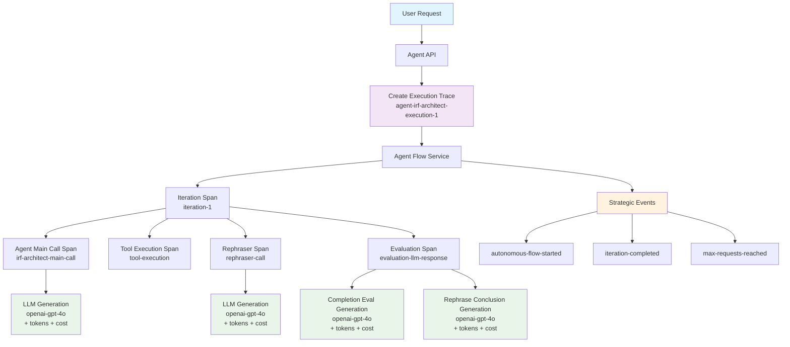

# Langfuse Tracing System Guide

## 🎯 Overview

This guide covers the comprehensive Langfuse tracing system implemented for multi-agent journey tracking. The system provides **dual tracing architecture** that captures both high-level agent workflows and granular LLM interactions.

## 🏗️ Architecture

### Dual Tracing Architecture

```
📊 Session Management (User-centric)
   └── 🔍 Execution Traces (Sequential: agent-{type}-execution-1, agent-{type}-execution-2...)
       ├── 📊 Agent Journey Spans (Workflow tracking)
       │   ├── 🔍 LLM Generations (Actual AI calls with model/tokens/cost)
       │   ├── 📊 Tool Execution Spans
       │   └── 📊 Evaluation Spans
       └── 📢 Strategic Events (Flow milestones)
```

### Visual Architecture Flow



### Key Components

1. **Session-based Tracing**: Groups all traces under a user session
2. **Execution Traces**: Sequential traces per agent execution (`agent-irf-architect-execution-1`, `agent-general-assistant-execution-2`)
3. **Hierarchical Spans**: Nested spans for different workflow stages
4. **LLM Generations**: Granular tracking of actual AI calls with metadata
5. **Performance Tracking**: Timing, memory, and cost analytics

### Example Trace Names

With the new agent-type-specific naming, traces are now much more descriptive:

```
✅ Current Pattern (Agent Type Included)
- agent-irf-architect-execution-1
- agent-general-assistant-execution-2
- agent-storyblok-editor-execution-3
- agent-figma-to-storyblok-execution-4
- agent-rephraser-execution-5
- agent-scribe-execution-6
- agent-site-builder-execution-7
- agent-orchestrator-execution-8
```

This makes it immediately clear which agent type was executed for each trace in the Langfuse dashboard! 🎯

## 🔧 Core Service: `langfuse.service.ts`

### Initialization

```typescript
const langfuseService = serviceRegistry.get("langfuse");
```

### Session Management Methods

#### Create Execution Trace

```typescript
const { trace, traceName, executionNumber } = langfuseService.createExecutionTrace(
  sessionToken: string,
  agentType: string,
  conversationId?: number,
  metadata?: Record<string, any>
);
```

#### Create Spans

```typescript
const span = langfuseService.createSpanForSession(
  sessionToken: string,
  spanName: string,
  metadata?: Record<string, any>,
  input?: any
);
```

#### Create Generations (LLM Calls)

```typescript
const generation = langfuseService.createGenerationForSession(
  sessionToken: string,
  options: {
    name: string;
    model: string;
    input: any;
    metadata?: Record<string, any>;
  }
);
```

#### Add Events

```typescript
langfuseService.addEventToSession(
  sessionToken: string,
  eventName: string,
  properties?: Record<string, any>
);
```

#### End Execution Trace

```typescript
langfuseService.endExecutionTrace(
  sessionToken: string,
  output?: any,
  error?: Error | string
);
```

## 🎯 Implementation Patterns

### 1. Agent Journey Tracing (`agent.ts`)

```typescript
// Start execution trace
const { trace } = langfuseService.createExecutionTrace(
  context.sessionToken,
  agentType,
  context.conversationId,
  {
    userMessage: context.userMessage.substring(0, 100),
    autonomousMode: options.autonomousMode,
  }
);

try {
  // Execute agent flow
  const result = await agentFlowService.executeAutonomousFlow(context, options);

  // End with success
  langfuseService.endExecutionTrace(context.sessionToken, result);
} catch (error) {
  // End with error
  langfuseService.endExecutionTrace(context.sessionToken, null, error);
}
```

### 2. Agent Action Spans (`agent-flow.service.ts`)

```typescript
// Create span for agent call (NOT generation - that happens in LLM service)
const mainSpan = context.sessionToken
  ? langfuse.createSpanForSession(
      context.sessionToken,
      `${agentType}-main-call`,
      {
        agentType,
        messageCount: messages.length,
        startTime: new Date().toISOString(),
      },
      messages
    )
  : null;

try {
  const response = await agent.act({ messages, context });

  // End span with success
  if (mainSpan) {
    mainSpan.end({
      output: response,
      metadata: {
        duration_ms: Math.round(duration),
        success: true,
        responseLength: JSON.stringify(response).length,
      },
    });
  }
} catch (error) {
  // End span with error
  if (mainSpan) {
    mainSpan.end({
      error,
      metadata: {
        duration_ms: Math.round(duration),
        success: false,
      },
    });
  }
}
```

### 3. LLM Generation Tracking (`llm.service.ts`)

```typescript
// Create generation within session trace
let generation;
if (traceContext && traceContext.sessionId) {
  generation = langfuseService.createGenerationForSession(
    traceContext.sessionId,
    {
      name: `openai-${model}`,
      model,
      input: {
        messages,
        tools: tools.map(t => ({ name: t.function?.name || t.name })),
        temperature: 0.1,
      },
      metadata: {
        provider: "openai",
        agentType: traceContext.agentType,
        toolCount: tools.length,
        ...traceContext.metadata,
      },
    }
  );
}

try {
  const response = await openai.chat.completions.create({...});

  // End generation with usage and cost
  if (generation) {
    const usage = response.usage;
    const cost = langfuseService.calculateCost(model, {
      input: usage?.prompt_tokens,
      output: usage?.completion_tokens,
      total: usage?.total_tokens,
    });

    generation.end({
      output: response.choices[0]?.message,
      usage: {
        input: usage?.prompt_tokens,
        output: usage?.completion_tokens,
        total: usage?.total_tokens,
      },
      cost,
    });
  }
} catch (error) {
  if (generation) {
    generation.end({
      error: error instanceof Error ? error.message : String(error),
    });
  }
}
```

### 4. Passing Trace Context

#### In Agent Factories (`configurable-agent.factory.ts`)

```typescript
// Create trace context for LLM call
const traceContext = input.context?.sessionToken
  ? {
      sessionId: input.context.sessionToken,
      conversationId: input.context?.conversationId,
      agentType: config.id,
      metadata: {
        attempt,
        maxRetries: config.behavior.maxRetries,
        responseFormat: config.behavior.responseFormat,
        toolCount: toolsToUse.length,
      },
    }
  : undefined;

const response = await base.llmService.runLLM({
  messages,
  tools: toolsToUse,
  traceContext, // Pass context to LLM service
});
```

#### In Services (`evaluation.service.ts`)

```typescript
const evaluateResponse = async ({
  userMessage,
  response,
  traceContext, // Accept trace context
}: {
  // ... other params
  traceContext?: {
    sessionId: string;
    conversationId?: number;
    agentType?: string;
    metadata?: Record<string, any>;
  };
}) => {
  const completionEvaluation = await llmService.runLLM({
    messages: [...],
    tools: [evaluateResponseToolDefinition],
    traceContext: traceContext ? {
      sessionId: traceContext.sessionId,
      conversationId: traceContext.conversationId,
      agentType: traceContext.agentType,
      metadata: {
        evaluationStep: "completion-evaluation",
        ...traceContext.metadata,
      },
    } : undefined,
  });
};
```

## 📊 Performance Tracking Patterns

### Timing & Memory Tracking

```typescript
// Start timing and memory tracking
const startTime = performance.now();
const startMemory = process.memoryUsage();

const span = langfuse.createSpanForSession(sessionToken, "operation-name", {
  startTime: new Date().toISOString(),
  startMemoryMB: Math.round(startMemory.heapUsed / 1024 / 1024),
});

try {
  // Execute operation
  const result = await someOperation();

  // End with performance metrics
  const endTime = performance.now();
  const endMemory = process.memoryUsage();
  const duration = endTime - startTime;
  const memoryDelta = endMemory.heapUsed - startMemory.heapUsed;

  span.end({
    output: result,
    metadata: {
      duration_ms: Math.round(duration),
      endTime: new Date().toISOString(),
      success: true,
      endMemoryMB: Math.round(endMemory.heapUsed / 1024 / 1024),
      memoryDeltaMB: Math.round(memoryDelta / 1024 / 1024),
    },
  });
} catch (error) {
  // End with error metrics
  span.end({
    error,
    metadata: {
      duration_ms: Math.round(performance.now() - startTime),
      success: false,
    },
  });
}
```

## 🔍 Strategic Events

### Flow Milestones

```typescript
// Autonomous flow started
langfuse.addEventToSession(sessionToken, "autonomous-flow-started", {
  agentType,
  maxRequests,
  startTime: new Date().toISOString(),
});

// Iteration completed
langfuse.addEventToSession(sessionToken, "iteration-completed", {
  iterationNumber: i + 1,
  totalIterations: maxRequests,
  hasToolCalls: !!response.tool_calls,
  responseLength: response.content?.length || 0,
});

// Max requests reached
langfuse.addEventToSession(sessionToken, "max-requests-reached", {
  totalIterations: requestsCount,
  finalConclusion: finalConclusion?.substring(0, 100),
});
```

## 📈 Cost Calculation

The system automatically calculates costs for different models:

```typescript
const calculateCost = (
  model: string,
  usage: { input?: number; output?: number; total?: number }
): { input: number; output: number; total: number } => {
  const costs: Record<string, { input: number; output: number }> = {
    "gpt-4o": { input: 0.0025, output: 0.01 }, // per 1K tokens
    "gpt-4o-mini": { input: 0.00015, output: 0.0006 },
    "gpt-4-turbo": { input: 0.01, output: 0.03 },
    "claude-3-sonnet": { input: 0.003, output: 0.015 },
    // ... more models
  };

  const modelCosts = costs[model] || { input: 0.001, output: 0.003 };
  return {
    input: (usage.input || 0) * (modelCosts.input / 1000),
    output: (usage.output || 0) * (modelCosts.output / 1000),
    total: inputCost + outputCost,
  };
};
```

## 🎯 Best Practices

### 1. **Spans vs Generations**

- **Spans**: For workflow stages, tool executions, evaluations
- **Generations**: Only for actual LLM API calls

### 2. **Trace Context Passing**

Always pass `traceContext` through the call chain:

```typescript
Agent → LLM Service → Session Generation
```

### 3. **Metadata Strategy**

Include relevant context in metadata:

- Performance metrics (timing, memory)
- Operation context (iteration numbers, agent types)
- Content metrics (response lengths, compression ratios)

### 4. **Error Handling**

Always handle errors in tracing:

```typescript
try {
  // Operation
} catch (error) {
  if (span) {
    span.end({ error });
  }
  throw error; // Re-throw after tracing
}
```

### 5. **Session Management**

- One session per user session token
- Sequential execution traces within sessions
- Clean up sessions when they expire

## 🛠️ Debugging & Monitoring

### Session Statistics

```typescript
const stats = langfuseService.getSessionStats();
console.log({
  activeSessions: stats.activeSessions,
  totalExecutions: stats.totalExecutions,
  sessionTokens: stats.sessionTokens,
});
```

### Cleanup

```typescript
// Clean up expired sessions
langfuseService.cleanupSession(sessionToken);
```

## 🚀 Integration Examples

### Adding Tracing to New Services

1. **Accept trace context parameter**:

```typescript
const myService = async (params: {
  // ... other params
  traceContext?: LLMTraceContext;
}) => {
  // Implementation
};
```

2. **Create spans for operations**:

```typescript
const span = traceContext?.sessionId
  ? langfuse.createSpanForSession(
      traceContext.sessionId,
      "my-operation",
      metadata
    )
  : null;
```

3. **Pass context to LLM calls**:

```typescript
await llmService.runLLM({ messages, tools, traceContext });
```

4. **End spans with metrics**:

```typescript
span?.end({ output, metadata: { duration_ms, success: true } });
```

## 📚 Related Files

- **Core Service**: `packages/thegrid/src/services/atoms/LangfuseService/langfuse.service.ts`
- **Agent Integration**: `packages/thegrid/src/routes/api/agent/agent.ts`
- **Flow Service**: `packages/thegrid/src/agent/services/AgentFlowService/agent-flow.service.ts`
- **LLM Service**: `packages/thegrid/src/domains/ai/services/LLMService/llm.service.ts`
- **Agent Factories**: `packages/thegrid/src/agent/factories/`
- **Evaluation Service**: `packages/thegrid/src/services/EvaluationService/evaluation.service.ts`

## 🎯 Benefits

1. **Comprehensive Visibility**: Full tracing from user request to LLM responses
2. **Performance Analytics**: Detailed timing, memory, and cost tracking
3. **Error Tracking**: Granular error capture at every level
4. **Cost Management**: Real-time cost tracking per LLM call
5. **Operational Insights**: Agent performance and bottleneck identification
6. **Debugging**: Rich context for troubleshooting complex multi-agent flows

This system provides the foundation for powerful analytics, monitoring, and optimization of the multi-agent platform! 🚀
