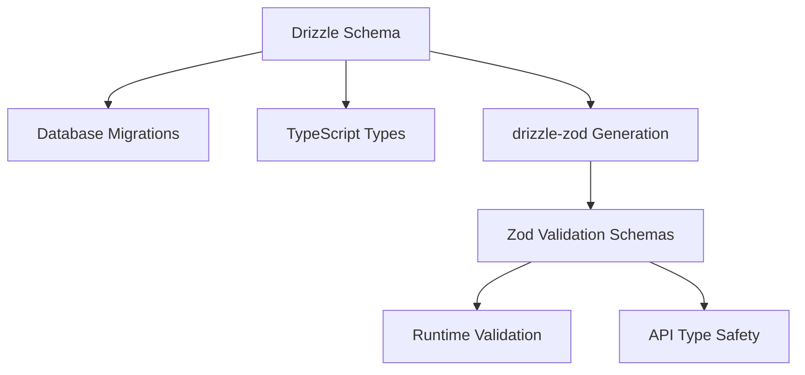

# Database Schema & Validation Architecture

This document explains our approach to database schemas, type safety, and runtime validation using Drizzle ORM and Zod.

## 🏗️ Architecture Overview

### Core Principles

1. **Single Source of Truth**: Drizzle schemas define the database structure
2. **Automatic Validation**: Zod schemas are generated from Drizzle schemas
3. **Type Safety**: Full TypeScript inference from database to API
4. **Runtime Safety**: Validate data at API boundaries with proper error handling



## 📁 File Structure

```
src/db/
├── schema/
│   ├── index.ts              # Central export for all schemas
│   ├── conversations.ts      # Conversation & message tables
│   ├── pipelines.ts          # Pipeline execution tables
│   ├── memory.ts             # User memory & RAG tables
│   └── ...                   # Other domain schemas
├── zod-schemas.ts            # Generated Zod validation schemas
├── validation-examples.ts    # Basic validation examples
└── README.md                 # This file
```

## 🔧 Implementation Details

### Drizzle Schemas (Source of Truth)

Our database schemas are defined using Drizzle ORM:

```typescript
// src/db/schema/conversations.ts
export const conversations = pgTable("conversations", {
  id: serial("id").primaryKey(),
  title: varchar("title", { length: 255 }).notNull(),
  systemMessage: text("system_message"),
  createdAt: timestamp("created_at").defaultNow().notNull(),
  updatedAt: timestamp("updated_at").defaultNow().notNull(),
});
```

### Zod Schema Generation

The `zod-schemas.ts` file automatically generates Zod validation schemas from Drizzle schemas:

```typescript
// Automatic generation from Drizzle schemas
export const conversationSelectSchema = createSelectSchema(
  dbSchema.conversations
);
export const conversationInsertSchema = createInsertSchema(
  dbSchema.conversations
);
export const conversationUpdateSchema = createUpdateSchema(
  dbSchema.conversations
);
```

### Type Inference

We use a custom type inference approach that preserves actual types (not `any`):

```typescript
// Custom type inference that works with drizzle-zod
type InferSchema<T> = T extends { _output: infer U } ? U : never;

export type ConversationSelect = InferSchema<typeof conversationSelectSchema>;
export type ConversationInsert = InferSchema<typeof conversationInsertSchema>;
export type ConversationUpdate = InferSchema<typeof conversationUpdateSchema>;
```

## 📖 Usage Guide

### 1. Basic Validation

```typescript
import { conversationInsertSchema, ConversationInsert } from "@/db/zod-schemas";

// Type-safe data structure
const newConversation: ConversationInsert = {
  title: "New Chat",
  systemMessage: "You are a helpful assistant",
  // id, createdAt, updatedAt are auto-generated
};

// Runtime validation
const result = conversationInsertSchema.safeParse(userData);
if (result.success) {
  console.log(result.data); // Fully typed and validated
} else {
  console.error(result.error.format()); // Detailed error info
}
```

### 2. API Endpoint Validation

```typescript
import { messageInsertSchema, MessageInsert } from "@/db/zod-schemas";

// Hono API endpoint example
app.post("/api/messages", async (c) => {
  const body = await c.req.json();

  // Validate incoming data
  const result = messageInsertSchema.safeParse(body);
  if (!result.success) {
    return c.json({ error: result.error.format() }, 400);
  }

  // result.data is now properly typed as MessageInsert
  const message = await db.insert(messages).values(result.data);
  return c.json(message);
});
```

### 3. Helper Functions

```typescript
import { validateConversationInsert } from "@/db/zod-schemas";

// Simplified validation helper
const validData = validateConversationInsert(userInput);
if (validData) {
  // Data is valid and properly typed
  await createConversation(validData);
} else {
  // Handle validation error
  throw new Error("Invalid conversation data");
}
```

## 🎯 Available Schemas

### Core Entities

- **Conversations**: `conversationSelectSchema`, `conversationInsertSchema`, `conversationUpdateSchema`
- **Messages**: `messageSelectSchema`, `messageInsertSchema`, `messageUpdateSchema`
- **Attachments**: `attachmentSelectSchema`, `attachmentInsertSchema`, `attachmentUpdateSchema`

### Pipeline System

- **Pipelines**: `pipelineSelectSchema`, `pipelineInsertSchema`, `pipelineUpdateSchema`
- **Pipeline Steps**: `pipelineStepSelectSchema`, `pipelineStepInsertSchema`, `pipelineStepUpdateSchema`

### Agent Execution

- **Agent Executions**: `agentExecutionSelectSchema`, `agentExecutionInsertSchema`, `agentExecutionUpdateSchema`
- **Execution Steps**: `agentExecutionStepSelectSchema`, `agentExecutionStepInsertSchema`, `agentExecutionStepUpdateSchema`

### Memory System

- **User Memories**: `userMemorySelectSchema`, `userMemoryInsertSchema`, `userMemoryUpdateSchema`
- **Memory Tags**: `memoryTagSelectSchema`, `memoryTagInsertSchema`, `memoryTagUpdateSchema`
- **Memory Retrievals**: `memoryRetrievalSelectSchema`, `memoryRetrievalInsertSchema`, `memoryRetrievalUpdateSchema`

### Other Systems

- **Sessions**: `sessionSelectSchema`, `sessionInsertSchema`, `sessionUpdateSchema`
- **Files**: `fileSelectSchema`, `fileInsertSchema`, `fileUpdateSchema`
- **Approvals**: `approvalSelectSchema`, `approvalInsertSchema`, `approvalUpdateSchema`
- **Notifications**: `notificationSelectSchema`, `notificationInsertSchema`, `notificationUpdateSchema`
- **Signals**: `signalSelectSchema`, `signalInsertSchema`, `signalUpdateSchema`
- **Changelogs**: `changelogSelectSchema`, `changelogInsertSchema`, `changelogUpdateSchema`
- **Storyblok Components**: `storyblokComponentSelectSchema`, `storyblokComponentInsertSchema`, `storyblokComponentUpdateSchema`

## 🔬 Technical Details

### Why This Approach?

1. **Type Safety**: TypeScript can infer exact types from database schema
2. **DRY Principle**: Define schema once, use everywhere
3. **Runtime Safety**: Validate data at API boundaries
4. **Maintainability**: Schema changes automatically propagate to validation

### Solving TypeScript Issues

Drizzle-zod generates `BuildSchema` types that don't satisfy Zod's strict `ZodType` interface. Our solution:

```typescript
// Instead of z.infer<typeof schema> (which returns 'any')
type InferSchema<T> = T extends { _output: infer U } ? U : never;

// This preserves the actual types from drizzle-zod
export type ConversationInsert = InferSchema<typeof conversationInsertSchema>;
```

### Benefits Over Manual Zod Schemas

| Manual Zod                | drizzle-zod Generation    |
| ------------------------- | ------------------------- |
| ❌ Duplicate definitions  | ✅ Single source of truth |
| ❌ Manual synchronization | ✅ Automatic updates      |
| ❌ Type drift risk        | ✅ Always in sync         |
| ❌ More maintenance       | ✅ Less maintenance       |

## 🚀 Best Practices

### 1. Use Specific Schema Types

```typescript
// ✅ Good - specific operation type
function createConversation(data: ConversationInsert) {}

// ❌ Avoid - too generic
function createConversation(data: any) {}
```

### 2. Validate at Boundaries

```typescript
// ✅ Validate external input
app.post("/api/data", async (c) => {
  const result = schema.safeParse(await c.req.json());
  // ... handle validation
});

// ✅ Trust internal data
function processValidatedData(data: ValidatedType) {
  // No need to re-validate
}
```

### 3. Handle Validation Errors Gracefully

```typescript
const result = schema.safeParse(data);
if (!result.success) {
  // Log the full error for debugging
  console.error("Validation failed:", result.error.format());

  // Return user-friendly error
  return { error: "Invalid data format" };
}
```

### 4. Use Helper Functions

```typescript
// Create reusable validation helpers
export const validateAndCreate = async <T>(
  schema: ZodSchema<T>,
  data: unknown,
  createFn: (validated: T) => Promise<any>
) => {
  const result = schema.safeParse(data);
  if (!result.success) {
    throw new ValidationError(result.error);
  }
  return createFn(result.data);
};
```

## 🔄 Schema Evolution

When you need to modify database schemas:

1. **Update Drizzle Schema**: Modify the table definition
2. **Generate Migration**: Run `drizzle-kit generate`
3. **Apply Migration**: Run `drizzle-kit migrate`
4. **Automatic**: Zod schemas automatically reflect changes

No manual Zod schema updates required! 🎉

## 🐛 Troubleshooting

### Common Issues

**TypeScript errors with `z.infer`:**

- Use our custom `InferSchema<T>` type instead
- Import types from `zod-schemas.ts`, not manual inference

**Validation failures:**

- Check the error format: `result.error.format()`
- Ensure required fields are provided
- Verify data types match schema expectations

**Schema not found:**

- Check that the table is exported from `schema/index.ts`
- Verify the schema file imports the table correctly

### Getting Help

1. Check this README for common patterns
2. Look at `validation-examples.ts` for basic usage
3. Review existing API endpoints for real-world examples
4. The Zod schemas preserve all TypeScript information for IntelliSense

---

## 📚 References

- [Drizzle ORM Documentation](https://orm.drizzle.team/)
- [drizzle-zod Integration](https://github.com/drizzle-team/drizzle-zod)
- [Zod Validation Library](https://github.com/colinhacks/zod)
- [TypeScript Conditional Types](https://www.typescriptlang.org/docs/handbook/2/conditional-types.html)
