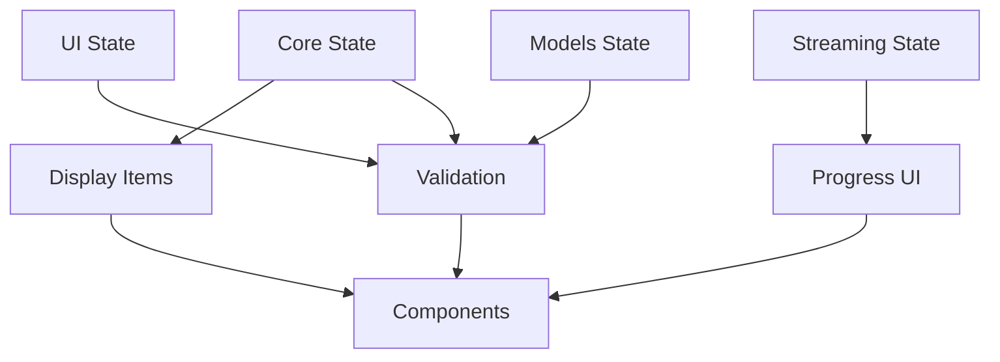

# Chat State Architecture

## 🏗️ Overview

This document explains the state management architecture for the chat feature, following **official Jotai patterns** and best practices recommended by the Jotai creator (dai-shi).

## 📁 Directory Structure

```
src/app/chat/_state/
├── chat/                    # Chat-specific state (feature-scoped)
│   ├── atoms/              # Private atoms organized by domain
│   │   ├── core.ts         # Conversation state & messages
│   │   ├── ui.ts           # UI state & form validation
│   │   ├── models.ts       # Model/agent selection
│   │   └── streaming.ts    # Streaming & TTS functionality
│   ├── hooks/              # Public hook API
│   │   ├── useChatCore.ts  # Conversation management hooks
│   │   ├── useChatUI.ts    # UI state hooks
│   │   ├── useModels.ts    # Model selection hooks
│   │   └── useStreaming.ts # Streaming hooks
│   ├── providers/          # Context providers for scope isolation
│   └── index.ts           # Public API exports
├── index.ts               # Chat state exports
└── ARCHITECTURE.md        # This file
```

## 🎯 Core Principles

### 1. **Private/Public Atom Pattern**

```typescript
// ❌ DON'T: Export base atoms directly
export const messagesAtom = atom<Message[]>([]);

// ✅ DO: Keep base atoms private, expose through derived atoms
const _messagesAtom = atom<Message[]>([]);
export const messagesAtom = atom((get) => get(_messagesAtom));
```

### 2. **Hook-Based Public API**

```typescript
// ❌ DON'T: Import atoms directly in components
import { messagesAtom } from "../atoms/core";

// ✅ DO: Use custom hooks
import { useConversation } from "../_state/chat";
const { messages } = useConversation();
```

### 3. **Domain-Scoped Organization**

- **Core**: Conversation data, messages, timeline
- **UI**: Form state, attachments, validation
- **Models**: AI model/agent selection
- **Streaming**: Real-time updates, progress, TTS

### 4. **Action Atoms for State Mutations**

```typescript
// Separate action atoms for each operation
export const addMessageAtom = atom(null, (get, set, message: Message) => {
  const current = get(_messagesAtom);
  set(_messagesAtom, [...current, message]);
});
```

## 🔗 State Relationships



## 📋 Migration Benefits

### Before (Legacy Pattern)

```typescript
// Multiple imports, direct atom access
import { messagesAtom, isLoadingAtom, attachmentsAtom } from "../chatAtoms";

const [messages] = useAtom(messagesAtom);
const [isLoading] = useAtom(isLoadingAtom);
const [attachments] = useAtom(attachmentsAtom);
```

### After (Hook Pattern)

```typescript
// Single import, clean API
import { useConversation, useChatUIState } from "../_state/chat";

const { messages, isLoading } = useConversation();
const { attachments } = useChatUIState();
```

## 🎨 Benefits Achieved

1. **Better Encapsulation**: Internal atom structure can change without breaking components
2. **Cleaner Components**: No prop drilling, single import per domain
3. **Type Safety**: Hooks provide better TypeScript experience
4. **Easier Testing**: Mock hooks instead of individual atoms
5. **Future-Proof**: Can add computed properties without breaking changes
6. **Performance**: Fine-grained reactivity through atomic updates

## 📚 References

- [Official Jotai Custom Hooks Pattern](https://jotai.org/docs/recipes/custom-useatom-hooks)
- [Jotai Creator's Recommendations](https://github.com/pmndrs/jotai/discussions/896)
- [Action Atoms Pattern](https://jotai.org/docs/guides/composing-atoms)
